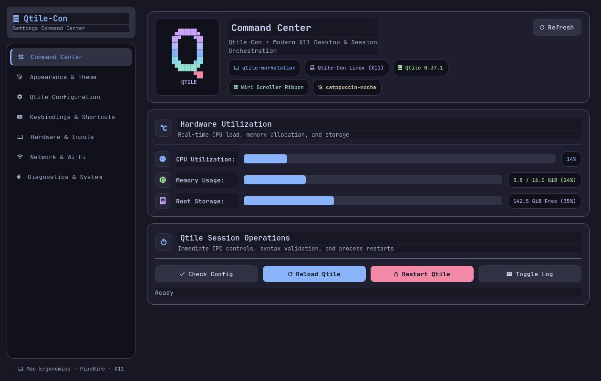
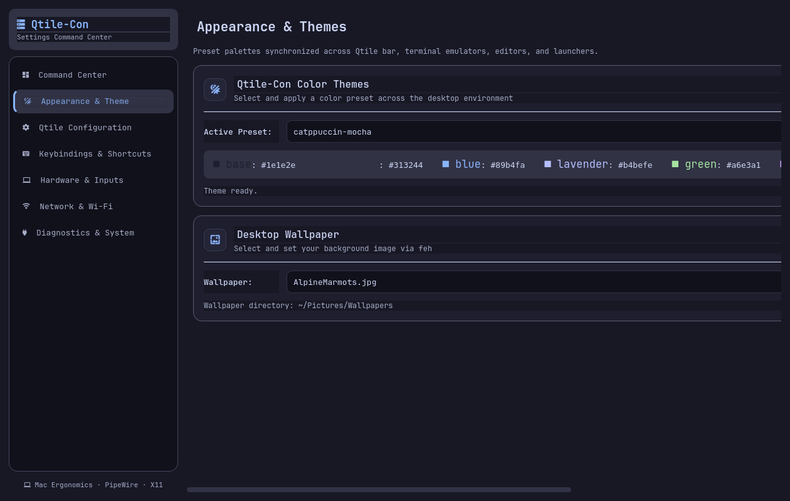
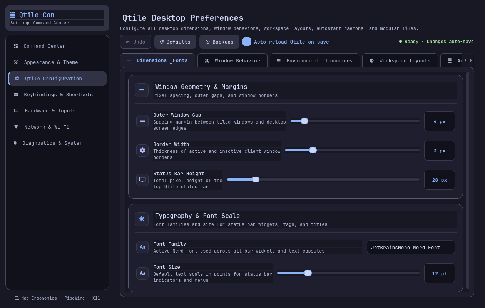
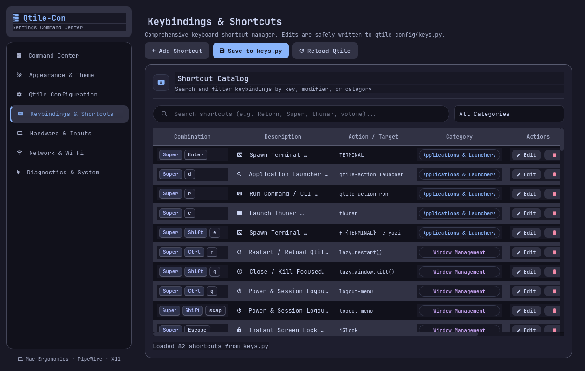
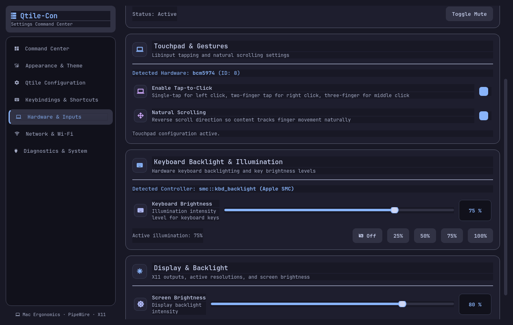
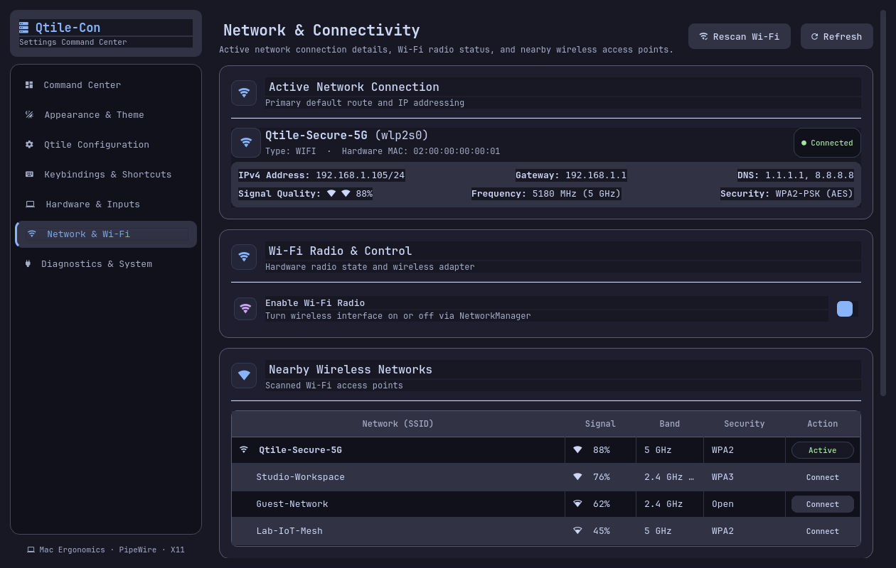
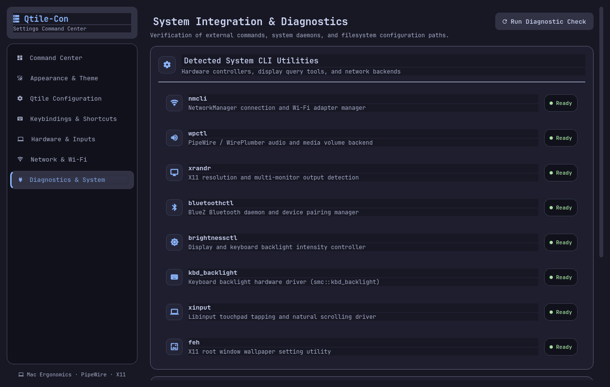
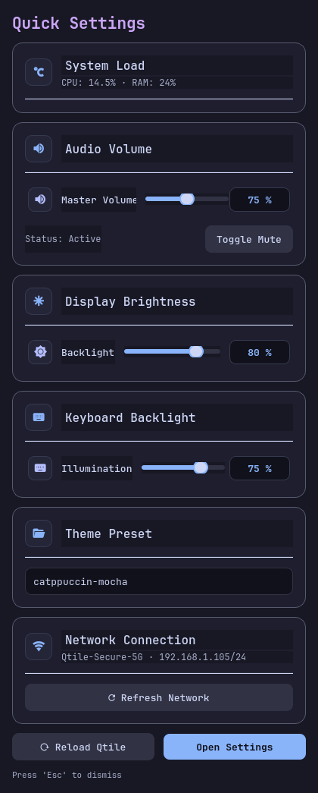

# Qtile Settings & Command Center

A modern, comprehensive PySide6 settings center and quick-settings command dashboard for Qtile on X11, styled with a polished Material 3 aesthetic inspired by **DankMaterialShell** and dynamic palettes (**Catppuccin Mocha, Frappe, Latte, Gruvbox Dark, Ayu Dark, GitHub Dark, Solarized Dark**).

Designed specifically for seamless integration with the **Qtile-Con** desktop environment, this application acts as a central **Settings and Session Command Center** providing intuitive GUI preferences control, dynamic live theme auto-updating, system diagnostics, and hardware management.

<div align="center">



*Live dynamic theme auto-update, categorized shortcuts, hardware illumination presets, network control, and system diagnostics.*

</div>

---

## Table of Contents
- [Supported Operating Systems](#supported-operating-systems)
- [Prerequisites](#prerequisites)
  - [System Requirements](#system-requirements)
  - [Supported System Tools](#supported-system-tools)
  - [Qtile-Con Integration Points](#qtile-con-integration-points)
- [Quickstart & Installation](#quickstart--installation)
  - [1. Automated Idempotent Installation with Fallbacks](#1-automated-idempotent-installation-with-fallbacks-recommended)
  - [2. Automated Clean Uninstallation & Purge](#2-automated-clean-uninstallation--purge)
  - [3. NixOS Setup (Nix Flake & Classic Nix)](#3-nixos-setup-nix-flake--classic-nix)
  - [4. Manual Installation Options](#4-manual-installation-options)
  - [5. Launching the Application](#5-launching-the-application)
- [Feature Overview](#feature-overview)
  - [1. Command Center & Overview](#1-command-center--overview)
  - [2. Dynamic Real-Time Theme Auto-Update](#2-dynamic-real-time-theme-auto-update)
  - [3. Qtile Desktop Preferences](#3-qtile-desktop-preferences)
  - [4. Keybindings & Shortcuts Manager](#4-keybindings--shortcuts-manager)
  - [5. Hardware & Inputs (Including Keyboard Backlight)](#5-hardware--inputs)
  - [6. Network & Connectivity](#6-network--connectivity)
  - [7. System Diagnostics](#7-system-diagnostics)
  - [8. Quick Settings Popup (`--quick`)](#8-quick-settings-popup---quick)
- [Qtile-Con Keybinding Integration](#qtile-con-keybinding-integration)
- [Verification & Automated Testing](#verification--automated-testing)
- [Security & Architecture](#security--architecture)

---

## Supported Operating Systems

The installer and runtime fully support all operating systems and package manager ecosystems listed in the **Qtile-Con** matrix:

| Distribution / OS Family | Package Manager | Pre-requisite Helper Command |
| :--- | :--- | :--- |
| **Debian / Ubuntu / Linux Mint / Pop!_OS / Parrot OS / Kali** | `apt` | `./install.sh --install-deps` |
| **Arch Linux / Manjaro / EndeavourOS / Garuda / Artix** | `pacman` | `./install.sh --install-deps` |
| **Fedora / Nobara / RHEL / CentOS / Rocky / AlmaLinux** | `dnf` | `./install.sh --install-deps` |
| **openSUSE Leap / Tumbleweed** | `zypper` | `./install.sh --install-deps` |
| **Void Linux** | `xbps` | `./install.sh --install-deps` |
| **Solus Linux** | `eopkg` | `./install.sh --install-deps` |
| **Gentoo Linux** | `emerge` | `./install.sh --install-deps` |
| **FreeBSD** | `pkg` | `./install.sh --install-deps` |
| **NixOS / Nix** | `nix` | `nix run .` / `flake.nix` |

---

## Prerequisites

### System Requirements
- **Operating System**: Linux with an active **X11** display session (`echo $XDG_SESSION_TYPE` reports `x11`).
- **Python**: Python 3.10+ (tested and verified on Python 3.13).
- **Qtile**: Qtile window manager installed and running under your user account.
- **GUI Libraries**: PySide6 (Qt 6) and `psutil`.
- **Fonts**: A Nerd Font supporting Powerline/Material symbols (e.g., `JetBrainsMono Nerd Font Propo`, `Symbols Nerd Font`).

### Supported System Tools
The application dynamically detects available system tools and provides fallbacks where possible:
- `brightnessctl` or `xbacklight`: Display backlight brightness controls and hardware illumination (**keyboard backlight** / `smc::kbd_backlight` / `leds`).
- `fastfetch`: Source for the dynamic Qtile ASCII/Unicode block-art brand logo rendered in truecolor ANSI.
- `nmcli`: NetworkManager device info, Wi-Fi radio power toggle, AP scanning, and connection queries.
- `wpctl`, `pamixer`, or `pactl`: PipeWire / WirePlumber / PulseAudio volume, mute toggles, and live level badges.
- `xrandr`: Multi-monitor detection, active resolution querying, and display geometry reports.
- `xinput`: Libinput touchpad gesture configuration (tap-to-click, natural scrolling).
- `feh`: Wallpaper setting backend fallback.

### Qtile-Con Integration Points
When running alongside a Qtile-Con installation, the application automatically interfaces with:
- `~/.config/qtile/qtile_config/settings.py`: Core desktop metrics, gaps, fonts, and launcher settings.
- `~/.config/qtile/qtile_config/keys.py`: Keyboard shortcuts and Mac hardware ergonomics.
- `~/.config/qtile/config.py`: Top-level window manager behavior policies.
- `~/.cache/qtile/workspace_layouts.json`: Per-workspace independent layout assignments.
- `~/.config/qtile/scripts/autostart`: Desktop daemons and background services.
- `~/.config/qtile/themes/*.json`: Theme presets (Catppuccin Mocha, Gruvbox Dark, Solarized Dark, etc.).
- `~/.config/qtile/scripts/apply-global-theme`: Global theme synchronization across Qtile, terminals, editors, and menus.
- `~/.config/qtile/scripts/set-wallpaper`: Wallpaper setting backend.
- `~/.local/share/qtile/qtile.log`: Qtile window manager runtime log.

---

## Quickstart & Installation

### 1. Automated Idempotent Installation with Fallbacks (Recommended)

An idempotent installer script is provided at `install.sh` (symlinked to `integration/install.sh`). It handles package installation, multi-tier execution fallbacks, XDG desktop entries, and Qtile keybinding registration automatically:

```sh
git clone <repo-url> qtile-settings
cd qtile-settings
./install.sh
```

**Script CLI Options:**
```sh
./install.sh --help
# Options:
#   --install-deps   Install system dependencies using detected package manager (requires sudo)
#   --no-deps        Skip system package dependency checks
#   --dry-run        Show detected OS, planned actions, and exit without changes
#   --yes, -y        Non-interactive mode
```

**What `install.sh` does safely:**
1. **OS Detection**: Identifies the host distribution and package manager from the Qtile-Con supported matrix.
2. **Multi-Tier Installation Fallbacks**:
   - **Tier 1 (pipx)**: Installs into an isolated user environment using `pipx install --force --system-site-packages .`.
   - **Tier 2 (Dedicated Virtualenv)**: If `pipx` is absent, automatically creates `${REPO_DIR}/.venv` with system site-packages and symlinks the binary to `~/.local/bin/qtile-settings`.
   - **Tier 3 (Standalone Wrapper)**: If virtual environment creation fails (e.g., minimalist containers), creates an executable wrapper at `~/.local/bin/qtile-settings` that invokes Python with repository `PYTHONPATH`.
3. **Desktop Launcher Registration**: Installs `qtile-settings.desktop` and `qtile-quick-settings.desktop` into `~/.local/share/applications/` and refreshes the desktop database.
4. **Keybinding Integration**: Checks `keys.py` (modular `qtile_config/keys.py`, non-modular `keys.py`, or `config.py`), creates a timestamped `.backup.<timestamp>` file, and injects `Super + S` and `Super + Shift + S`.
5. **Failsafe Validation**: Runs `qtile check -c ~/.config/qtile/config.py`. If syntax validation fails, it automatically rolls back the change.
6. **Idempotence**: Re-running `./install.sh` detects existing bindings and skips re-injection without duplicate code.

### 2. Automated Clean Uninstallation & Purge

To revert system modifications:

```sh
# Standard clean uninstallation (removes binaries, desktop files, restores keybindings)
./uninstall.sh

# Complete purge (removes binaries, desktop files, restores keybindings, AND purges all backups & caches)
./uninstall.sh --purge
```

**Uninstaller Options:**
- `--purge`, `--all`: Removes all timestamped backup files (`*.backup.*`), cache directories (`~/.cache/qtile-settings`), and fallback virtualenvs.
- `--dry-run`: Previews all files and actions that would be removed without touching the filesystem.
- `--yes`, `-y`: Non-interactive mode.

### 3. NixOS Setup (Nix Flake & Classic Nix)

For NixOS users and Nix package manager users, first-class Flake and classic derivation support is provided via `flake.nix` and `default.nix`.

#### Run directly with Nix Flakes:
```sh
# Open full Settings & Command Center:
nix run .

# Open compact Quick Settings popup:
nix run .#quick

# Enter an interactive development shell:
nix develop
```

#### Install into user profile:
```sh
nix profile install .
```

#### Use in NixOS `configuration.nix`:
Add `qtile-settings` as an input in your system flake:
```nix
inputs = {
  nixpkgs.url = "github:NixOS/nixpkgs/nixos-unstable";
  qtile-settings.url = "github:<user>/qtile-settings";
};
```
Enable the included module:
```nix
{
  imports = [ inputs.qtile-settings.nixosModules.default ];

  programs.qtile-settings.enable = true;
}
```

#### Use in Home Manager:
```nix
{
  imports = [ inputs.qtile-settings.homeManagerModules.default ];

  programs.qtile-settings.enable = true;
}
```

#### Classic `nix-build` / `nix-shell`:
```sh
nix-build default.nix
nix-shell
```

### 4. Manual Installation Options

#### Option A: Global Installation via pipx
```sh
pipx install --force --system-site-packages .
```

#### Option B: Editable Development Environment
```sh
python3 -m venv --system-site-packages .venv
source .venv/bin/activate
pip install --upgrade pip
pip install -e '.[dev]'
```

### 5. Launching the Application

```sh
# Open the full Settings & Command Center window:
qtile-settings

# Open the compact always-on-top Quick Settings popup:
qtile-settings --quick
```

Default keyboard shortcuts configured by `install.sh`:
- **`Super + S`**: Open full Settings & Command Center.
- **`Super + Shift + S`**: Open Quick Settings popup.

---

## Feature Overview

### 1. Command Center & Overview


- **Authentic Qtile Fastfetch Brand Header**: Features the custom Unicode/ANSI TrueColor block-art Qtile logo dynamically extracted and rendered from Fastfetch configuration (`~/.config/fastfetch/config.jsonc`) inside a squircle card container.
- **System & Session Badges**: Displays Hostname, Pretty OS name (`platform.freedesktop_os_release`), Qtile version, active layout (`~/.cache/qtile-current-layout`), and current desktop theme in a responsive pill cluster.
- **System Utilization**: Live monitoring of CPU load %, RAM usage (used / total GiB), and root storage free space.
- **Qtile Session Controls**:
  - **Check Config**: Runs `qtile check -c ~/.config/qtile/config.py` safely.
  - **Reload Qtile**: Triggers dynamic IPC configuration reload without restarting applications.
  - **Restart Qtile**: Full window manager restart with safety confirmation.
  - **Runtime Log Viewer**: Embedded, toggleable viewer for `~/.local/share/qtile/qtile.log`.

### 2. Dynamic Real-Time Theme Auto-Update



- **Instant Auto-Update on Selection**: Selecting any theme in the Appearance page (`ThemePage`) or Quick Settings popup (`QuickSettings`) automatically updates the Qtile Settings GUI styling, window manager colors, and desktop environment immediately.
- **Startup Theme Restoration**: The application automatically starts with your currently selected theme loaded from `~/.config/qtile/themes/current_theme.json`.
- **Live File System Synchronization (`QFileSystemWatcher`)**: If the active theme is changed externally (via terminal, `set-theme`, `apply-global-theme`, or Rofi theme selector), Qtile Settings detects the change on disk and reloads its palette and stylesheet in real time without requiring a restart.
- **Complete Material 3 Semantic Token Resolution**: Intelligently derives `surface`, `surfaceContainer`, `surfaceContainerHigh`, `surfaceContainerHighest`, `outline`, `outlineVariant`, and `muted` from theme JSON definitions (`mantle`, `base`, `surface0`, `surface1`, `surface2`, `overlay`), cleanly transforming dark themes (Mocha, Frappe, Gruvbox, Ayu, GitHub Dark, Solarized) and light themes (Latte) alike.
- **Wallpaper Manager**: Detects images in `WALLPAPER_DIR` and applies them using `set-wallpaper` or `feh`.

### 3. Qtile Desktop Preferences



A 6-tab control panel with instant debounced auto-saving, live undo stack, and backup management:
- **Interactive Undo & Safety**:
  - **󰕌 Undo Button**: Dynamically tracks changes in an undo history stack and reverts the latest adjustment in both the GUI and configuration files with one click.
  - **󰑐 Restore Defaults**: Resets all `settings.py` and `config.py` metrics back to factory defaults with automatic backup creation.
  - **󰋚 Configuration Backups**: Interactive browser dialog displaying timestamped `.backup.*` files with file sizes and one-click rollback.
- **Dimensions & Fonts**: Window gap (`GAP`), border width (`BORDER_WIDTH`), bar height (`BAR_HEIGHT`), font family picker (`FONT`), and font size slider (`FONT_SIZE`).
- **Window Behavior**: `follow_mouse_focus`, `bring_front_click`, `cursor_warp`, `auto_fullscreen`, `focus_on_window_activation`, and `wmname` (LG3D).
- **Environment & Launchers**: Primary modifier key (`MOD`), terminal emulator (`TERMINAL`) with one-click test launch, app launcher (`LAUNCHER`), and wallpaper folder (`WALLPAPER_DIR`) with directory browser.
- **Workspace Layouts**: Independent layout selector for Workspaces 1 through 9 (`columns`, `scroller`, `monadtall`, `monadwide`, `max`, `floating`, `matrix`, `bsp`) stored in `~/.cache/qtile/workspace_layouts.json`.
- **Autostart Daemons**: Real-time status monitoring (running/stopped) and restart controls for `lxpolkit`, `dunst`, `greenclip`, `nm-applet`, `xsettingsd`, and `gesture-daemon`.
- **Modular Config Files Editor**: In-app syntax-checked editor for all modular Python files (`config.py`, `settings.py`, `keys.py`, `groups.py`, `layouts.py`, `widgets.py`, `screens.py`, `colors.py`) with automatic timestamped backups.

### 4. Keybindings & Shortcuts Manager



- **Authoritative Descriptions**: Complete cheatsheet mapping of all 82 Qtile-Con shortcuts with human-readable titles, functional icons, and categories (Screenshots, Media, Workspaces, Window Control, Layouts).
- **Hardware Keycaps**: Displays combinations with styled keyboard keycaps (`[Super] + [Shift] + [q]`).
- **Live Search & Filter**: Instant filtering by key name, modifier, description, underlying command, or category chips with color badges.
- **Interactive Editing**:
  - Modal Add & Edit dialogs to adjust modifier checkboxes, key names, action types (`spawn`, `kill`, `restart`, `layout`, `fullscreen`, `floating`, `maximize`, `minimize`), and commands.
  - Delete shortcut with confirmation.
- **Safe Persistence**: Writes back to `keys.py` with automatic timestamped backup and Python syntax validation, followed by instant Qtile IPC reload.

### 5. Hardware & Inputs



- **Audio Output**: Master volume slider with live percentage pill badge (`[ 75% ]`) and mute toggle.
- **Touchpad Controls**: Libinput tap-to-click and natural scrolling switches with detected hardware report.
- **Display Brightness**: Screen backlight slider (1-100%) and active X11 display resolution summaries (`xrandr`).
- **Keyboard Backlight**:
  - Hardware illumination controller supporting Apple SMC (`smc::kbd_backlight`) and Linux LED subsystems (`/sys/class/leds/*::kbd_backlight`).
  - Interactive slider (0–100%) with live percentage readout.
  - Quick preset buttons: `Off (0%)`, `25%`, `50%`, `75%`, `100%`.
  - Automatic detection and graceful fallback when keyboard backlight hardware is absent.

### 6. Network & Connectivity



- **Active Connection Details**: Visual status card displaying connection name, interface device, connection type (Wi-Fi / Ethernet), IPv4 address and CIDR, default gateway, DNS servers, hardware MAC address, Wi-Fi frequency/band, security protocol, and signal quality gauge.
- **Wi-Fi Radio Control**: Toggle switch to enable or disable the wireless radio via NetworkManager.
- **Clean SSID & Band Presentation**:
  - Filters out hidden and empty SSIDs (`--`, `::`, blank rows).
  - Deduplicates access points across 2.4 GHz and 5 GHz, consolidating into clean labels (`5 GHz`, `2.4 GHz`, `2.4 GHz / 5 GHz`).
  - Signal strength represented by Material Wi-Fi icons (`󰤨`, `󰤥`, `󰤢`, `󰤟`) and active connection pinned to top.
- **Detected Interfaces Table**: Complete table of physical and virtual interfaces (`wlp2s0`, `enp1s0f0`, `docker0`, `lo`) with type, operational state, and active connection.

### 7. System Diagnostics



- Available in the **Tools & Diagnostics** page, wrapped in a scroll area to maintain font clarity on any display scale.
- Inspects and displays the operational status of all CLI tools (`qtile`, `xrandr`, `nmcli`, `wpctl`, `xinput`, `brightnessctl`, `feh`).
- Shows hardware device detection states (Display backlight, Keyboard backlight).
- Confirms configuration and runtime log paths.

### 8. Quick Settings Popup (`--quick`)

<div align="center">



</div>

- Floating always-on-top compact panel.
- Real-time CPU & RAM gauges.
- Audio volume slider and mute button.
- Display brightness slider.
- Keyboard backlight brightness slider.
- Quick theme switcher dropdown with real-time automatic styling updates.
- Active network status indicator with IP and SSID.
- One-click "Reload Qtile" and "Open Settings" buttons.
- Escape key instant dismissal.

---

## Qtile-Con Keybinding Integration

If you prefer to manually merge keybindings into `~/.config/qtile/qtile_config/keys.py` instead of running `./install.sh`:

```python
from libqtile.config import Key
from libqtile.lazy import lazy

# Add to your existing keys list:
keys.extend([
    Key([MOD], "s", lazy.spawn("qtile-settings"), desc="Open Qtile Settings & Command Center"),
    Key([MOD, "shift"], "s", lazy.spawn("qtile-settings --quick"), desc="Open Qtile Quick Settings"),
])
```

- **Super + S**: Opens the full Settings & Command Center.
- **Super + Shift + S**: Opens the Quick Settings popup.

---

## Verification & Automated Testing

Run the full automated test suite and code quality checks:

```sh
# Run code linter
ruff check .

# Run test suite (70 headless unit and integration tests)
pytest -v
```

All 70 automated tests run headlessly in an offscreen Qt environment and verify:
- Integration testing with the live Qtile-Con environment (`keys.py` parsing, preferences, themes, `qtile check` validation).
- Nix Flake (`flake.nix`) and classic Nix (`default.nix`) syntax, derivation outputs, and modules.
- Executability, CLI option parsing (`--help`, `--dry-run`), and purge behavior of `install.sh` and `uninstall.sh`.
- Real-time dynamic theme auto-updating, `resolve_theme_colors()` semantic token mappings, and `get_current_theme_palette()`.
- Keyboard backlight hardware detection, percentage reading, and level adjustment.
- Live undo stack, defaults reset, and backup restoration.
- AST keybinding parsing, serialization, backup creation, and editing.
- NetworkManager queries, Wi-Fi scanning, band consolidation, IP parsing, and command fallbacks.
- Workspace layouts cache persistence and autostart service monitoring.
- Safe command execution and error isolation.
- Theme presets, palette extraction, and global application.
- Wallpaper discovery and validation.
- Touchpad and backlight controls.
- Fastfetch logo extraction and ANSI truecolor HTML conversion.
- Qtile IPC commands and runtime log reading.
- Full UI window and quick-settings popup lifecycle in offscreen Qt mode.

---

## Security & Architecture

- **Non-Destructive User-Space Configuration**: All settings changes cleanly interface with standard user runtime config directories (`~/.config/qtile/`, `~/.cache/qtile/`), ensuring existing environments remain safely isolated and fully portable.
- **Unprivileged Execution**: The GUI runs strictly under the standard user account; no root permissions or broad `sudoers` rules are required.
- **Non-Shell Execution**: External commands are invoked with argument lists (`subprocess.run(argv, shell=False)`), preventing shell injection.
- **Static Configuration Parsing**: Config values and keybindings are read via Python's `ast.parse` and `ast.literal_eval` without importing or executing arbitrary user code.
- **Failsafe Backups**: Writes create a timestamped `.backup.<timestamp>` copy alongside the target file before modifying it.
- **Sanitized Codebase**: Free of hardcoded passwords, personal tokens, private keys, MAC addresses, or personal identifying information.
